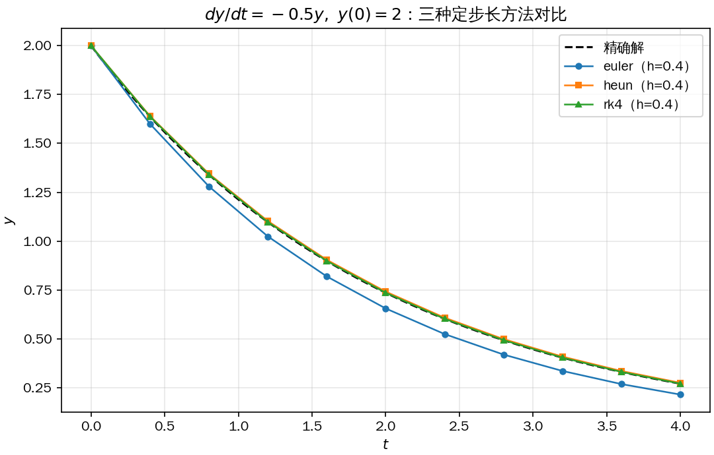
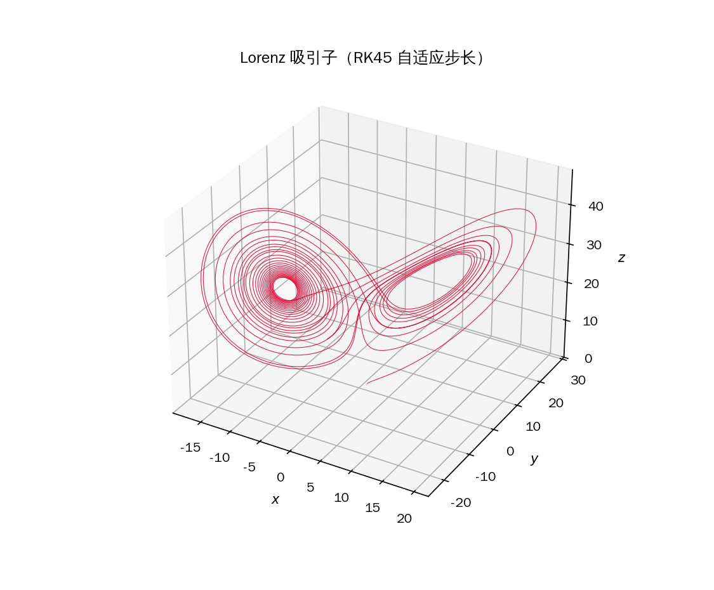
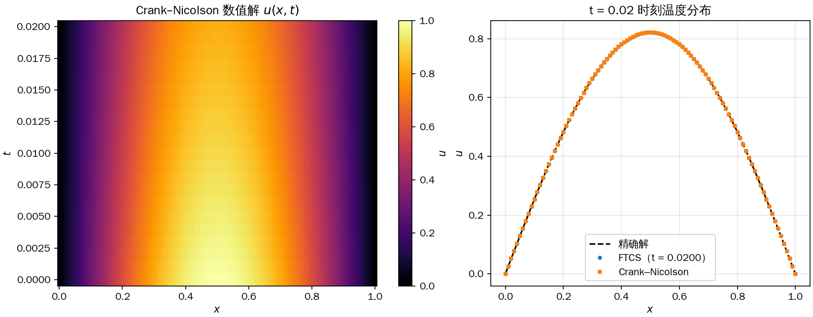
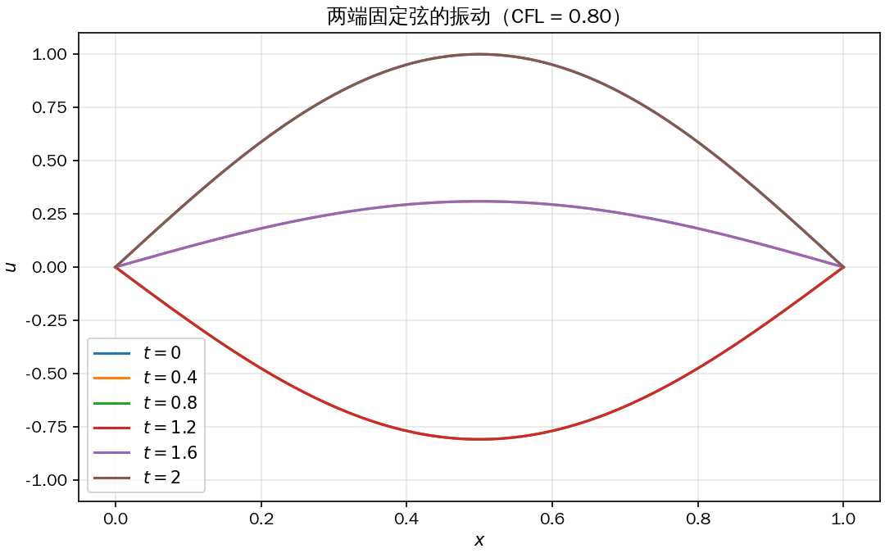
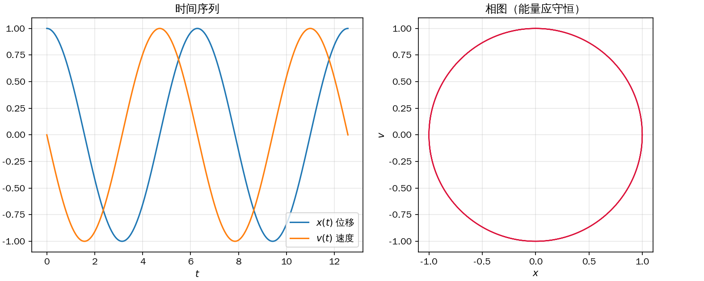
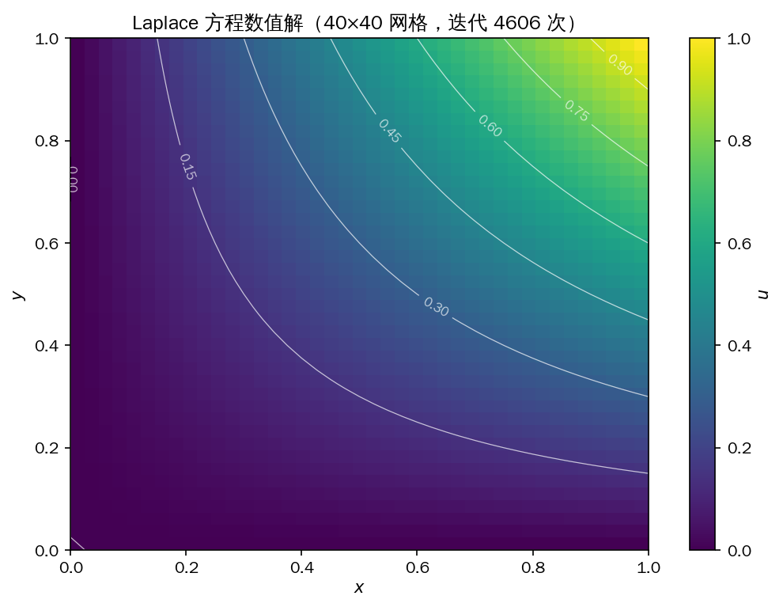

# diffeq-toolkit

> 用纯 Python（NumPy + Matplotlib）实现的微分方程数值求解工具库：
> 覆盖**常微分方程（ODE）初值问题**与**三类典型偏微分方程（PDE）**，
> 自带收敛阶验证、完整单元测试与示例画廊，适合教学、原型验证与课程设计。

[](https://github.com/Beethozart-12/diffeq-toolkit/actions/workflows/ci.yml)
[](LICENSE)


## ✨ 功能特性

### 常微分方程（`diffeq.ode`）

| 方法 | 调用方式 | 阶数 | 说明 |
| --- | --- | --- | --- |
| 显式 Euler | `solve_ode(..., method="euler")` | O(h) | 基础教学格式 |
| Heun（改进 Euler） | `solve_ode(..., method="heun")` | O(h²) | 二阶 Runge–Kutta |
| 经典 RK4 | `solve_ode(..., method="rk4")` | O(h⁴) | 定步长默认方法 |
| Dormand–Prince 5(4) | `solve_ivp(...)` | 自适应 O(h⁵) | 步长随误差自动伸缩（类 MATLAB `ode45`） |

- 支持标量方程与任意维一阶方程组 `y' = f(t, y)`
- `diffeq.diagnostics.convergence_orders`：自动估计数值方法的**观测收敛阶**

### 偏微分方程（`diffeq.pde`）

| 方程 | 格式 | 稳定性 |
| --- | --- | --- |
| 一维热传导 `u_t = α·u_xx` | FTCS 显式 | 条件稳定 `r = α·dt/dx² ≤ 1/2`（自动检查并报错） |
| 一维热传导 `u_t = α·u_xx` | Crank–Nicolson 隐式 | 无条件稳定，Thomas 算法 O(n) 求解 |
| 一维波动 `u_tt = c²·u_xx` | 中心差分（蛙跳） | CFL 条件 `c·dt/dx ≤ 1`（自动检查并报错） |
| 二维 Laplace `u_xx + u_yy = 0` | Gauss–Seidel 迭代 | 迭代至残差收敛，返回迭代次数 |

### 可视化（`diffeq.plotting`）

`plot_ode` / `plot_heat` / `plot_snapshots` / `plot_laplace`，统一返回 `(fig, ax)` 便于二次定制；
自动探测系统中文字体（Noto CJK / 微软雅黑 / SimHei 等），图内中文正常显示。

## 📦 安装

```bash
git clone https://github.com/Beethozart-12/diffeq-toolkit.git
cd diffeq-toolkit

pip install -e .            # 常规使用
pip install -e ".[dev]"     # 开发模式（含 pytest）
```

依赖：Python ≥ 3.9、`numpy`、`matplotlib`。

## 🚀 快速上手

### 常微分方程

```python
import numpy as np
from diffeq.ode import solve_ode, solve_ivp

# 1. 标量方程 dy/dt = -0.5·y，y(0) = 2，定步长 RK4
t, y = solve_ode(lambda t, y: -0.5 * y, 2.0, (0.0, 4.0), n_steps=100)

# 2. 方程组：谐振子 x'' = -x（化为一阶方程组 [x, v]' = [v, -x]）
f = lambda t, s: [s[1], -s[0]]
t, y = solve_ode(f, [1.0, 0.0], (0.0, 2 * np.pi), n_steps=200)

# 3. 自适应步长（Dormand–Prince RK45），误差自动控制
t, y = solve_ivp(lambda t, y: -0.5 * y, 2.0, (0.0, 4.0),
                 rtol=1e-8, atol=1e-10)
```

### 偏微分方程

```python
import numpy as np
from diffeq.pde import solve_heat_crank_nicolson

x = np.linspace(0.0, 1.0, 101)
# 初值 sin(pi*x)、零边界，演化到 t = 0.02
u = solve_heat_crank_nicolson(
    np.sin(np.pi * x), alpha=1.0, dx=0.01, dt=0.001, n_steps=20,
)
# u 的形状为 (21, 101)：每行是某一时刻的空间分布
```

## 🖼 示例画廊

每个示例都是一个独立脚本，运行 `python examples/<脚本名>.py` 即可复现（图片输出到 `docs/images/`）：

| 指数衰减：三种定步长方法 | Lorenz 吸引子：自适应 RK45 |
| --- | --- |
|  |  |
| **热传导方程：FTCS vs Crank–Nicolson** | **波动方程：两端固定弦的驻波** |
|  |  |
| **谐振子：时间序列与相图** | **Laplace 方程：Gauss–Seidel 迭代** |
|  |  |

## 📁 项目结构

```
diffeq-toolkit/
├── src/diffeq/
│   ├── ode.py           # Euler / Heun / RK4 / 自适应 RK45（Dormand–Prince）
│   ├── pde.py           # 热传导 / 波动 / Laplace + Thomas 算法
│   ├── diagnostics.py   # 端点误差、观测收敛阶估计
│   └── plotting.py      # 可视化辅助（自动中文字体）
├── examples/            # 6 个可独立运行的示例
├── tests/               # pytest 单元测试
├── docs/images/         # 示例生成的图片（README 画廊）
├── .github/workflows/ci.yml   # GitHub Actions：3.9–3.12 全版本测试
├── pyproject.toml
└── LICENSE
```

## 🧪 测试

```bash
pytest            # 或 pytest -v 查看明细
```

测试覆盖：

- **精度**：各方法与精确解（指数衰减、谐振子、热传导、驻波、调和函数）的误差上界
- **收敛阶**：数值验证 Euler ≈ 1、Heun ≈ 2、RK4 ≈ 4 阶收敛
- **守恒律**：谐振子能量漂移 < 1e-6
- **稳定性守卫**：FTCS 违反 `r ≤ 1/2`、蛙跳违反 CFL 时正确抛出 `ValueError`
- **线性代数**：Thomas 算法与 `numpy.linalg.solve` 交叉验证
- **绘图冒烟测试**：无头环境下各绘图函数正常返回 `(fig, ax)`

## 🚢 发布到你自己的 GitHub

1. 在 GitHub 上新建一个**空仓库**（不要初始化 README）。
2. 替换占位信息：
   - `README.md` 与徽章中的 `Beethozart-12`
   - `LICENSE` 与 `pyproject.toml` 中的作者名
3. 本仓库已含初始提交，直接关联远程并推送：

   ```bash
   git remote add origin https://github.com/Beethozart-12/diffeq-toolkit.git
   git push -u origin main
   ```

推送后 GitHub Actions 会自动在 Python 3.9–3.12 上运行全部测试。

## 🤝 贡献

欢迎 Issue 与 PR！新增求解器建议：在 `src/diffeq/` 中实现、在 `tests/` 中
验证精度与收敛阶、在 `examples/` 中给出可复现示例。

## 📄 许可证

[MIT](LICENSE) © 2026 diffeq-toolkit contributors
